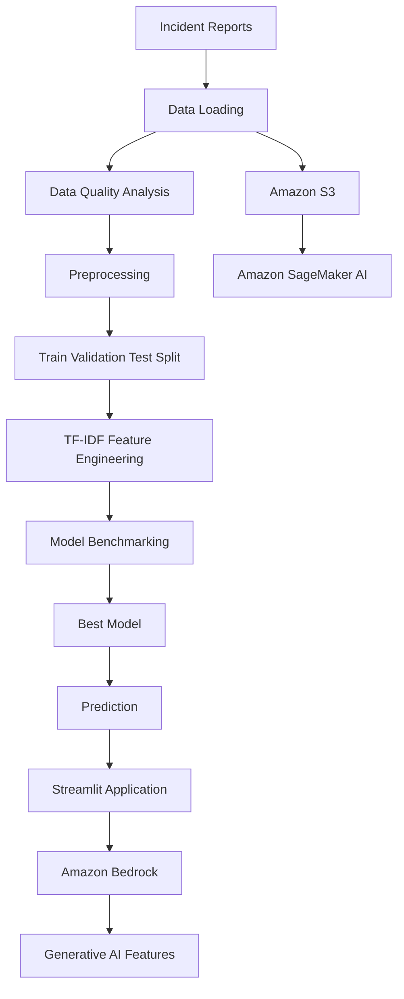

# Prompt: Generate SIRA README.md

## Role

You are a senior ML Engineer and technical documentation specialist. You write professional, clear, developer-friendly README files for real-world machine learning applications.

## Context

I am building a project called **Smart Incident Report Analyzer (SIRA)**.

SIRA is an AI/ML application that analyzes workplace incident reports and automatically classifies them into incident categories.

The project is being developed progressively as a practical ML engineering project:

1. Python fundamentals and object-oriented programming
2. Data loading and data quality analysis
3. Data preprocessing and text cleaning
4. NLP feature engineering
5. TF-IDF / Bag-of-Words vectorization
6. Train/validation/test data splitting
7. Machine learning model training
8. Model benchmarking
9. Model evaluation
10. Streamlit application development
11. AWS integration
12. Amazon S3 for dataset storage
13. Amazon SageMaker AI for ML workflows
14. Amazon Bedrock for generative AI capabilities
15. Prompt engineering for AI-powered features

The project currently uses classical machine learning for incident classification and is designed to demonstrate a complete ML engineering workflow from local development to AWS.

## Task

Create a professional `README.md` file for the SIRA project.

The README should explain the project clearly enough that:

* A developer can understand the project architecture.
* A student can understand what they are learning.
* A recruiter or technical reviewer can understand the engineering workflow.
* Another developer can clone the project and understand how to run it.
* The README can evolve as the project moves from local development to AWS.

## Project Information

Project name:

**Smart Incident Report Analyzer (SIRA)**

Primary purpose:

**Automatically classify workplace incident reports using machine learning and provide an AI-powered interface for analyzing incident reports.**

Current ML workflow:

```text
Raw Incident Reports
        ↓
Data Loading
        ↓
Data Quality Analysis
        ↓
Data Preprocessing
        ↓
Train / Validation / Test Split
        ↓
TF-IDF Feature Engineering
        ↓
Multiple ML Models
        ↓
Model Benchmarking
        ↓
Model Selection
        ↓
Final Evaluation
        ↓
Prediction
        ↓
Streamlit Application
```

Current candidate models include:

* Logistic Regression
* Naive Bayes
* Linear SVM
* Decision Tree
* Random Forest

The project uses a common model interface so different machine learning algorithms can be benchmarked without rewriting the entire pipeline.

## AWS Architecture

The AWS architecture should be explained as an evolving architecture rather than claiming that every component is already production-ready.

Current AWS services covered in the project include:

### Amazon S3

Used for storing datasets such as:

```text
s3://sira-data/raw/incident_reports_1000.csv
```

Explain why object storage is useful for ML datasets.

### Amazon SageMaker AI

Used for machine learning development, experimentation, training, and evaluation.

Explain its role in the ML workflow.

### Amazon Bedrock

Used for generative AI capabilities that complement the traditional ML classifier.

Potential capabilities include:

* Incident report summarization
* Natural-language explanations
* Generative report analysis
* Prompt-based AI assistance
* Future RAG/knowledge-based capabilities

Clearly distinguish **traditional ML classification** from **generative AI**.

## Prompt Engineering

The project also introduces prompt engineering concepts including:

* Zero-shot prompting
* One-shot prompting
* Few-shot prompting
* Role prompting
* Context prompting
* Constraint prompting
* Structured-output prompting

Explain that prompt engineering is used for the generative AI portion of SIRA and is separate from the TF-IDF/classical ML classification pipeline.

## README Structure

Use the following structure:

# Smart Incident Report Analyzer (SIRA)

## 1. Overview

Explain:

* What SIRA is
* The problem it solves
* Why incident classification is useful
* The role of ML and GenAI in the application

## 2. Problem Statement

Describe the real-world problem:

Organizations may receive large numbers of incident reports. Manually reviewing and categorizing these reports can be slow and inconsistent.

Explain how SIRA attempts to automate incident classification and assist analysts.

## 3. Objectives

List the project's main objectives.

Include objectives such as:

* Automate incident classification
* Apply NLP to unstructured text
* Compare multiple ML algorithms
* Evaluate model performance properly
* Build a reusable ML pipeline
* Deploy/use the system through a simple UI
* Introduce AWS cloud services
* Integrate generative AI capabilities
* Demonstrate practical ML engineering principles

## 4. Key Features

Describe the current and planned features.

Separate them into:

### Current Features

### Planned Features

Do not claim planned functionality is already implemented.

## 5. System Architecture

Include a Mermaid architecture diagram.

Use a diagram similar to:



Make the diagram accurately distinguish the classical ML pipeline from the generative AI components.

## 6. Machine Learning Pipeline

Explain each stage:

1. Data loading
2. Data quality analysis
3. Preprocessing
4. Text cleaning
5. Train/validation/test splitting
6. TF-IDF feature engineering
7. Model training
8. Model benchmarking
9. Model evaluation
10. Prediction

For every stage, explain its purpose briefly.

## 7. Model Benchmarking

Explain why SIRA does not immediately assume that one algorithm is the best.

Describe the candidate models:

| Model               | Type                     | Purpose                            |
| ------------------- | ------------------------ | ---------------------------------- |
| Logistic Regression | Linear classifier        | Strong baseline                    |
| Naive Bayes         | Probabilistic classifier | Efficient text classification      |
| Linear SVM          | Linear classifier        | Effective for sparse text features |
| Decision Tree       | Tree-based classifier    | Non-linear decision rules          |
| Random Forest       | Ensemble classifier      | Multiple decision trees            |

Explain that models should be compared using validation data when selecting the best model.

Explain that the test set should remain held out for final evaluation.

## 8. Model Evaluation

Explain these metrics:

* Accuracy
* Precision
* Recall
* F1 Score
* Confusion Matrix

Explain why relying on accuracy alone can be misleading for classification problems.

Also mention:

* Error analysis
* Class distribution
* Data leakage
* Duplicate/near-duplicate records
* Generalization

## 9. Data Quality

Explain that data quality is an important part of the SIRA workflow.

Mention issues such as:

* Missing values
* Duplicate records
* Empty reports
* Inconsistent capitalization
* Whitespace
* Inconsistent categories
* Date-format inconsistencies
* Text quality issues

Emphasize the principle:

> Analyze the data first, then clean it based on evidence.

## 10. NLP Feature Engineering

Explain:

* Bag of Words
* TF-IDF
* Sparse feature representations
* Vocabulary
* `fit_transform()`
* `transform()`

Explain why the vectorizer should be fitted only on the training data to avoid data leakage.

## 11. Project Structure

Show the project's directory structure.

Use this structure as the current reference:

```text
smart_incident_report_analyzer/
├── data/
│   ├── raw/
│   └── processed/
├── notebooks/
├── src/
│   ├── __init__.py
│   ├── data_loader.py
│   ├── preprocessing.py
│   ├── data_splitter.py
│   ├── feature_engineering.py
│   ├── model.py
│   ├── models/
│   │   ├── __init__.py
│   │   ├── logistic_regression.py
│   │   ├── naive_bayes.py
│   │   ├── svm_classifier.py
│   │   ├── decision_tree.py
│   │   └── random_forest.py
│   └── predictor.py
├── models/
├── app.py
├── train.py
├── benchmark.py
├── evaluate.py
├── requirements.txt
├── .gitignore
└── README.md
```

Explain the responsibility of the major files and directories.

## 12. Installation

Provide clear installation instructions.

Include:

```bash
git clone <repository-url>
cd smart_incident_report_analyzer
```

Then explain how to create a virtual environment.

For Windows:

```bash
python -m venv .venv
.venv\Scripts\activate
```

For Linux/macOS:

```bash
python3 -m venv .venv
source .venv/bin/activate
```

Install dependencies:

```bash
pip install -r requirements.txt
```

Do not invent additional dependencies that are not required by the project.

## 13. Running the Project

Explain how to:

### Run training

```bash
python train.py
```

### Run benchmarking

```bash
python benchmark.py
```

### Run evaluation

```bash
python evaluate.py
```

### Run the Streamlit application

```bash
streamlit run app.py
```

If a command may differ depending on the current implementation, clearly mark it as an example rather than presenting it as guaranteed.

## 14. AWS Setup

Explain the AWS services used by the project:

* IAM
* Amazon S3
* Amazon SageMaker AI
* Amazon Bedrock

Explain the role of each service.

Include an example S3 structure:

```text
sira-data/
├── raw/
│   └── incident_reports_1000.csv
└── processed/
```

Do not include real AWS credentials, access keys, secrets, or passwords.

Explain that credentials should be handled using secure AWS authentication mechanisms rather than hard-coded into Python files.

## 15. Security and Governance

Include practical security principles:

* Least privilege
* IAM roles
* Avoid hard-coded credentials
* Encryption
* Access control
* CloudTrail auditing
* Data protection
* Responsible AI
* Guardrails for generative AI where appropriate

Explain that production systems require stronger security controls than a classroom prototype.

## 16. Generative AI Architecture

Explain how Amazon Bedrock complements the traditional ML classifier.

Use a conceptual flow such as:

```text
Incident Report
      ↓
Traditional ML Classifier
      ↓
Incident Type
      ↓
Amazon Bedrock
      ↓
Summary / Explanation / AI Assistance
```

Clearly explain why a foundation model is not necessarily a replacement for every traditional ML component.

## 17. Prompt Engineering Examples

Include short examples demonstrating:

### Zero-shot

### One-shot

### Few-shot

### Role prompting

### Constraint prompting

### Structured output

Use SIRA-related examples.

Keep examples concise and educational.

## 18. Engineering Principles Demonstrated

Explain the software engineering principles demonstrated by the project:

* Separation of concerns
* Single responsibility
* Modularity
* Dependency injection
* Reusability
* Configuration over hard-coding
* Data leakage prevention
* Reproducibility
* Logging
* Error handling
* Model abstraction
* Experimentation
* Evaluation before deployment

## 19. Limitations

Be honest about limitations.

Mention that:

* The dataset is relatively small.
* Synthetic or highly repetitive data may produce unrealistically high performance.
* A 100% test score does not automatically mean production readiness.
* Real-world incident reports may contain ambiguity and class imbalance.
* Production deployment requires additional monitoring, security, validation, and governance.
* GenAI outputs can require validation because foundation models can produce incorrect or unsupported information.

## 20. Future Improvements

Suggest realistic future improvements such as:

* Larger and more diverse datasets
* Better annotation quality
* Hyperparameter tuning
* Cross-validation
* More robust error analysis
* Model versioning
* Model deployment through SageMaker
* Monitoring
* CI/CD
* RAG
* Amazon Bedrock Guardrails
* Human-in-the-loop review
* Authentication
* Database integration
* Production-grade observability

Clearly label these as future work.

## 21. Learning Outcomes

Because SIRA is also an educational project, include what students learn:

* Python for ML
* OOP
* Data preprocessing
* NLP
* Classical machine learning
* Model evaluation
* Model benchmarking
* ML engineering
* AWS fundamentals
* S3
* IAM
* SageMaker AI
* Amazon Bedrock
* Prompt engineering
* Responsible AI
* Cloud security

## 22. Disclaimer

State that SIRA is an educational/prototype project and should not be treated as a production-grade incident management or safety-critical system without appropriate validation, security review, governance, and human oversight.

## Writing Requirements

The README must be:

* Professional
* Clear
* Concise but sufficiently detailed
* Beginner-friendly
* Technically accurate
* Suitable for GitHub
* Easy to scan
* Organized with headings
* Rich in practical examples
* Free of unnecessary marketing language

Use Markdown formatting appropriately.

Use tables where they improve readability.

Use Mermaid diagrams where architecture is being explained.

Use code blocks for commands and code.

Do not fabricate metrics, deployment results, AWS costs, or production capabilities.

If an implementation detail is not explicitly provided, describe it as a planned or example implementation rather than claiming it currently exists.

## Output Format

Return ONLY the complete contents of the `README.md` file.

Do not wrap the README in JSON.

Do not add commentary before or after the README.

The final output must be directly copyable into:

```text
README.md
```
